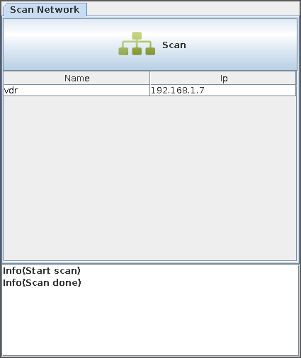
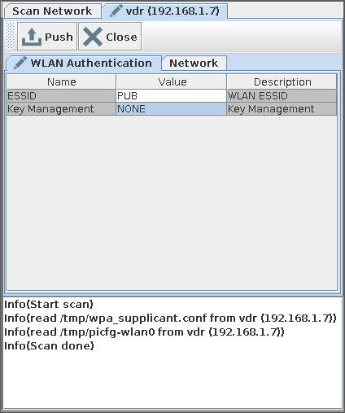

**! ONLY A PROTOTYPE !**

# pi remote configuration
 
currently to configure WLAN (WPA Supplicant, Network) properties.

 * on the pi side runs a golang daemon `src/main/go/picfgd.go`
 * plug the pi per ethernet in the network with a dhcp server
 * this tool sends a broadcast, and the golang daemon reponds pi's name and dhcp address
 * configure the wlan interface for your network, unplug the ethernet cable 

# screenshot

 

# current TODO's / FIXME's

    main% grep -r -E 'TODO|FIXME' src  
    src/main/scala/picfg/Scanner.scala:    //FIXME: broadcast address: 0.0.0.0 or 255.255.255.255 doesn't work - why?
    src/main/scala/picfg/config.scala:    // FIXME: this go's under /etc/wpa_supplicant/
    src/main/scala/picfg/config.scala:    // FIXME: this go's under  /etc/network/interfaces.d/picfg-wlan0
    src/main/scala/picfg/Remote.scala:    // FIXME: add timeout -> session.connect(timeout)!
    src/main/scala/picfg/Remote.scala:      //FIXME: bad!!!
    src/main/scala/picfg/elements.scala:      //FIXME: scrolling per mouse not possible!
    src/main/go/picfgd.go:			// FIXME: check msg
    src/main/go/picfgd.go:			// FIXME: use the eth0 ip - currently it use the first found ip

